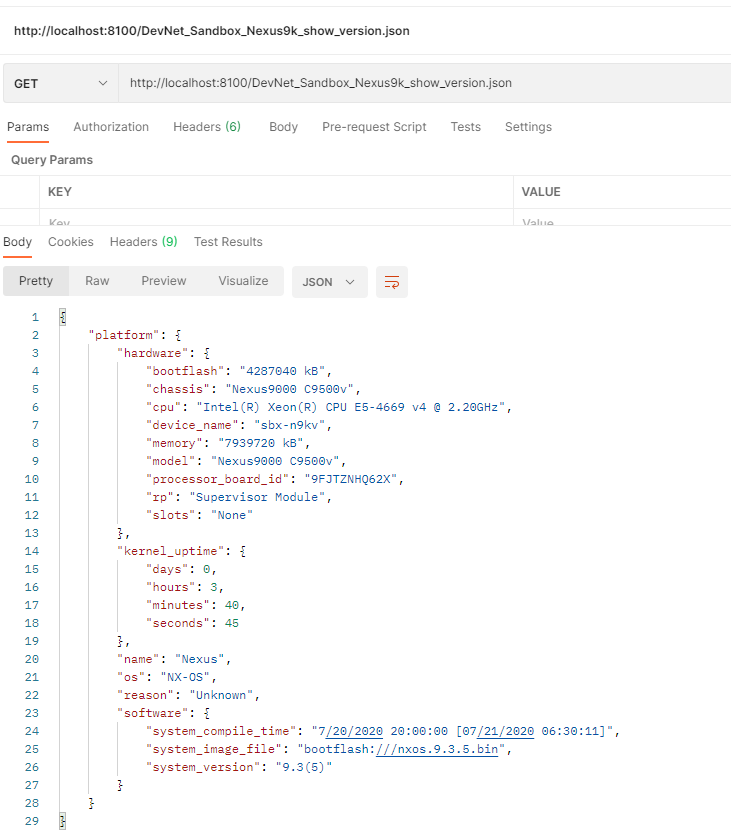

# Merlin Docker on a Cisco DevNet Sandbox Nexus 9000

For the main Merlin project and what Merlin does please visit:

[Merlin - Network Magic](https://github.com/automateyournetwork/merlin)

You can now run Merlin against a Nexus 9000 in the Cisco DevNet Sandbox.  We have included a custom script and pre-configured testbed file for this purpose.

>To get started, sign up for a Cisco DevNet account at: [DevNet Sandbox](https://devnetsandbox.cisco.com/RM/Topology)

>Once you are signed in, search for "Nexus" in the search dialog at the top left of the screen.


>Select one of the reserved instances - We recommend using the instance running the latest version of NXOS.


>Click "Reserve" after reviewing the reservation details.


You will receive an email from Cisco confirming the reservation along with links to download the Cisco AnyConnect VPN Client and instructions for its installation.

**Cisco AnyConnect VPN Client:**

[AnyConnect VPN Client](https://developer.cisco.com/site/sandbox/anyconnect/)

**Installation guide for Cisco AnyConnect VPN Client:**

[AnyConnect PDF](https://devnetsandbox.cisco.com/Docs/VPN_Access/AnyConnect_Installation_Guide.pdf)

>Click the "VPN Access" tab in the DevNet console and review the information in it.


**Note:** If this is your first time using the Cisco DevNet Sandbox, make sure to review the information in each of the tabs.

In about 15 to 20 minutes, you should receive another email from Cisco with the VPN credentials for your sandbox, including:

* VPN address and port for the connection
* VPN username
* VPN password

>Connect to the DevNet Sandbox VPN using the Cisco AnyConnect VPN Client


Once connected, you will have direct network access to the Nexus 9000 in DevNet.

The "NXOS on Nexus 9k" tab in the DevNet console will show you the details you need to connect to the device, however we have already added this information to the `testbed/testbed_DevNet_Nexus9k_Sandbox.yaml` file.

You can confirm it to be sure.


You're now ready to run Merlin against the DevNet Nexus 9000!

* To transform at least 16 common commands run the following pyATS job as a Docker Container:

# WSL2, Ubuntu, and Docker Desktop

1. Follow these instructions 

[Docker Desktop using WSL2](https://code.visualstudio.com/blogs/2020/03/02/docker-in-wsl2)


[Docker with WSL2 Backend](https://docs.docker.com/docker-for-windows/wsl/)


2. After you have WSL2, Ubuntu, and Docker Desktop installed you can proceed with cloning the repository 

``` console

git clone https://github.com/automateyournetwork/merlin_docker_nexus.git

```

3. Use docker-compose to create and build your Docker container and images 

``` console

docker-compose up

```


Now check Docker Desktop - Images to confirm all of your microservices are In Use 


Next check your Container / Apps and expand merlin_docker_nexus - you should see all of your images and their ports runing 


Now launch your browser and visit http://localhost:8080 to visit the Nexus 9000 Services Homepage


Click any of the links - here is the Show Version micro-service


Explore the JSON - which is the pyATS parse("show version") output 


The YAML 


The Markdown


You can also download the CSV version


You can also use the URL as a REST API 

In Postman do an HTTP GET against http://localhost:8080


Every microservice has it's own APIs - try http://localhost:8100 for Show Version


You can use the HTML Links in the bottom of the body to follow them in Postman 


You can follow these links for the JSON in Postman



Or the YAML 


Cisco has several APIs to get different information returned in JSON format. Using the Ansible URI Module you can access these APIs, query the JSON output, and create formatted CSV files. 

[Support API](https://developer.cisco.com/site/support-apis/)

* Bug information
* TAC case information
* End-of-X information
* Product information
* RMA information
* Software Suggestion (Gold Star)

[Services API](https://developer.cisco.com/docs/service-apis/)

* Contracts and Coverage information
* Customer information
* Inventory information
* Product Alerts (Field Notice, Security Advisory, Security Vulnerability)

[Product Security Incident Reponse Team](https://developer.cisco.com/psirt/)

* Accelerate Cisco Security Vulnerability Assessments
* Customize Cisco Vulnerability Notifications
* Use Open Security Standards

[Business Critical Insights](https://developer.cisco.com/docs/business-critical-service-apis/)

BCI portal shows various key performance indicators, trends and predictive analytic insights. The data shown on the portal is now also available through APIs.

## Onboarding Process

### SmartNet Total Care (SNTC)

Cisco account must have API Developer role

1. Log in [Cisco.com](https://cisco.com)
2. Go to Manage Profile
3. Smart Services section
4. API Developer role = Active

If not, click on Contact Company Adminstrator to know who to ask to get it.

### Cisco API console

Create an application add assign APIs

* Log in [Cisco API console](https://apiconsole.cisco.com)
* Go to My Apps & Keys
* Register a New App

  * Name of your application: <Name Your Application>
  * OAuth2.0 Credentials: Client Credentials

* Save
* Add APIs to the application

  * Software Suggestion API V2
  * PSIRT

* I agree to the terms and service
* Save

Please take note of:

* KEY: OAuth2.0 {{ client_id }}
* CLIENT_SECRET: OAuth2.0 {{ client_secret }}

Once you have your credentials update the /api_credentials/cisco.yaml file

```yaml
APIs:
  recommended_release:
    recommended_release_api_username: {{ YOUR RECOMMENDED RELEASE API USERNAME }}
    recommended_release_api_password: {{ YOUR API SECRET }}
  psirt:
    psirt_api_username: {{ YOUR PSIRT API USERNAME}}
    psirt_api_password: {{ YOUR PSIRT API SECRET }}
```

Uncomment out the PSIRT and Recommended Release instructions in the docker-compose.yml file

```yaml

  # YOU NEED TO UPDATE THE api_credentials/cisco.yaml file first with your SNTC API Credentials
  # THEN YOU NEED TO UPDAT THE IMAGE PATH TO YOUR DOCKERHUB REPO
  # THEN REMOVE COMMENTS
  # THEN YOU NEED TO docker-compose build / docker-compose up the images
  #psirt:
  #  image: {{ YOUR DOCKER HUB ACCOUNT HERE }}/{{ YOUR DOCKER HUB REPO HERE }}:psirt
  #  build: 
  #    context: ./
  #    dockerfile: ./docker/PSIRT/dockerfile
  #  ports:
  #    - "8108:80"
  #recommended_release:
  #  image: {{ YOUR DOCKER HUB ACCOUNT HERE }}/{{ YOUR DOCKER HUB REPO HERE }}:recommended_release
  #  build: 
  #    context: ./
  #    dockerfile: ./docker/Recommended_Release/dockerfile
  #  ports:
  #    - "8109:80"  

```

Now you have 2 new microservices the PSIRT report and the Recommended Software Release

[Back to the main project](https://github.com/automateyournetwork/merlin)